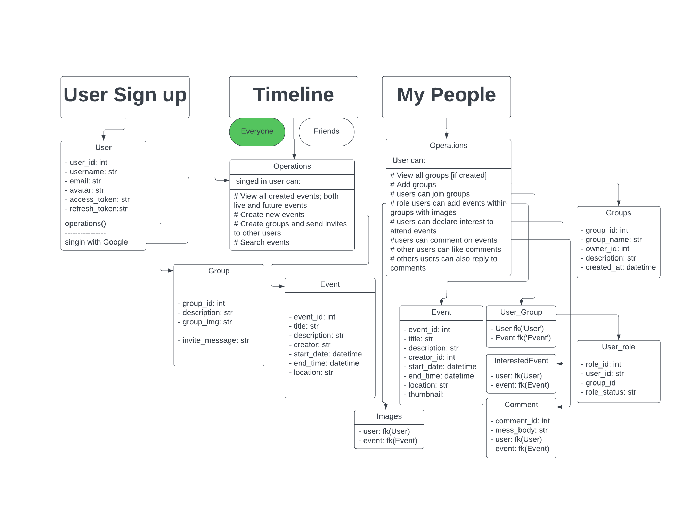

# Class UML Diagram For Event App Base On [User_Event_App_Workflow.txt](User_Event_App_Workflow.txt)
 
   

  ## Notes
  
   ### Relationships:
   - Users can create events (association between User and Event).
   - Users can belong to multiple groups (many-to-many association between User and Group).
   - Groups can contain multiple events (one-to-many association between Group and Event). 
   - Users can declare interest to event to events (many-to-many association between User). 
   - Users can have different roles within groups (many-to-many association between User and Group via User_Role).
    - eg
      1. The User_Role class represents the roles that users can have within groups in your event app.
         It's a pivotal part of your application's access control and permissions system.
         
        

        - `role_id: int:` This attribute is an identifier for each unique role record in the User_Role table.
          It typically serves as the primary key.

        - `user_id: int:` This attribute represents the user to whom the role is assigned.
           It is a foreign key that establishes a relationship between the User_Role and User classes, indicating which user holds a particular role within a group.

        - `group_id: int:` This attribute indicates the group to which the role is associated.
          It is also a foreign key, linking the User_Role class to the Group class and specifying which group the user has a role in.
        
        - `role: str`: This attribute represents the actual role or position that the user holds within the group. Examples of roles might include "Admin," "Member," "Moderator," or any other custom roles you define within your application.

        The `User_Role` class helps manage and enforce access control and permissions within your event app. By associating users with specific roles in specific groups, you can regulate what actions each user is allowed to perform within those groups. For instance, users with the "Admin" role might have elevated privileges, while "Members" might have more limited access.

   - Group owners have administrative rights over their groups (owner_id in Group).
    - eg.
       1. The owner_id in the Group class represents the user who is the owner or administrator of the group.
          This attribute signifies which user has administrative rights and control over the specific group.

  ## Some few changes were made based on the new design

   ### added updates

  - other `Users` can comment on newly created events
  - comments can also be liked
  - `Users` can reply to comments on newly created events

   ### reviewed changes

  - Notifications
